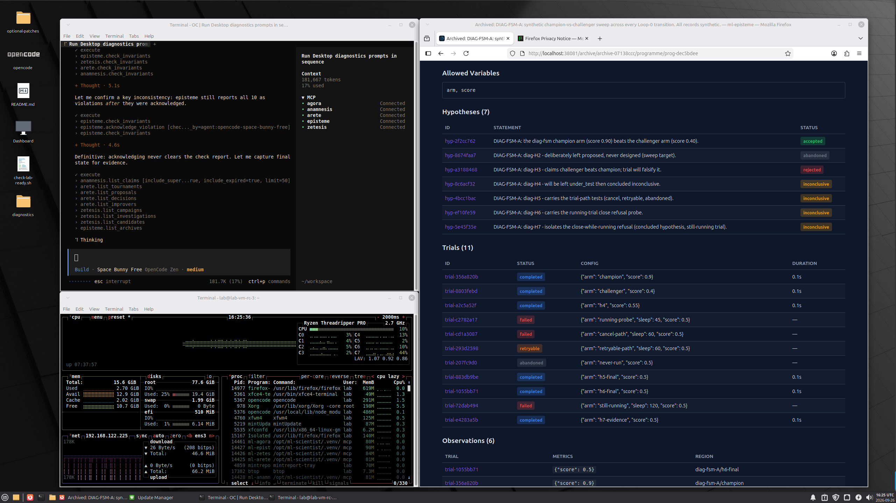
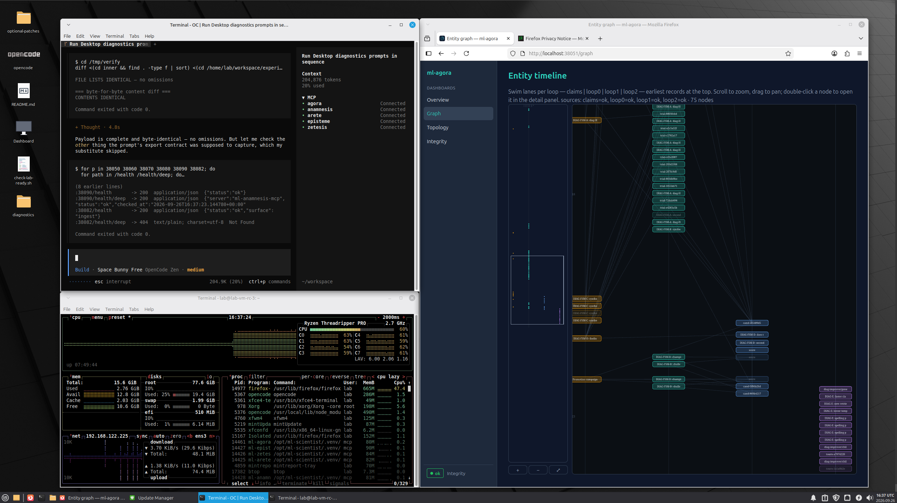

# LabLoop™: a research automation environment for empirical work

[](https://www.vibeleaderboard.ai/app/f2c98f41-5cbd-4d21-993d-3fefe4a82fc3) [](https://legit.show/s/gh-labloop)

Hypotheses, designed experiments, evidence and conclusions as
durable state — built for researchers, applications and AI agents
across any empirical domain.






Two projects, side by side. Each folder is self-contained and usable
on its own.

```text
ml-scientist/   the five ml-* MCP servers (agora, arete, zetesis,
                episteme, anamnesis) — run them anywhere, no VM needed
ml-labloop/     the KVM isolation harness — builds a per-user VM where
                those services run in a trusted zone, sealed off from
                a hostile experiment zone
```

## ml-scientist (standalone)

No VM required. From `ml-scientist/`:

```bash
uv sync --frozen
./labloop start all        # or ./run-ml-episteme.sh for a single server
./labloop status
```

Ports are defined in `ports.env` (38050/38060/38070/38080/38090).

## ml-labloop (the lab VM)

Requires KVM/libvirt on a Linux host. From `ml-labloop/`:

```bash
./00-build-lab-template.sh              # Mint ISO -> unattended build
./01-prepare-template-for-cloning.sh    # seal
./02-create-vm-from-template.sh <user>  # clone -> lab-vm-<user>
```

A locally built VM boots with login `lab` / password `lab` — change it
after first login.

`create-lab-template` finds the sibling `../ml-scientist` checkout
automatically (override with `ML_SCIENTIST=`). See `ml-labloop/README.md`
for the full workflow including publishing VM images.

## Download a prebuilt image

Released VM images live in the public Hugging Face bucket:
[https://huggingface.co/buckets/cloudcell/LabLoop](https://huggingface.co/buckets/cloudcell/LabLoop)

Download an image plus its checksum, verify it, then import it with
the script in `ml-labloop/release-package/`:

```bash
hf buckets cp hf://buckets/cloudcell/LabLoop/<image>.qcow2 .
hf buckets cp hf://buckets/cloudcell/LabLoop/<image>.qcow2.sha256 .
sha256sum -c <image>.qcow2.sha256
./import-lab-vm.sh <image>.qcow2 <vm-name>
```

Published images are sealed — unlike a local build, the `lab`/`exp`
passwords are locked and the import generates a one-time password for
first login. See `ml-labloop/release-package/import-lab-vm.sh` for
details.

## Appendix A — operations manual

Beyond the build/clone pipeline (`00`/`01`/`02`), the numbered
scripts cover the day-to-day operations on a running lab VM. All
data movement is **host-initiated over the qemu guest agent** — no
SSH, no virtiofs, no guest→host sockets.

### `10-upload-template-to-hf.sh [template]`

Seals a template for publication (locks `lab`/`exp` passwords,
sysprep, snapshot), flattens + compresses the qcow2, checksums it,
and uploads the pair to the private trials bucket
(`hf://buckets/LabLoopCommunity/lab-trials`). Asks before publishing.

### `11-release-template.sh [image] [--keep]`

Promotes a qcow2 + `.sha256` from the trials bucket to the public
release bucket (`hf://buckets/cloudcell/LabLoop`). Shows a numbered
menu when no name is given; verifies both objects landed before
removing them from the source (`--keep` copies instead of moving).

### `30-ensure-lab-tools.sh <vm>|all`

Idempotent in-place upgrade for VMs built before a tooling change.
Pushes the current `deploy/` payload into the guest — wrappers
(`labloop-exec`, `labloop-export`, `labloop-build`,
`labloop-update-opencode`), sudoers, quadlets, opencode config,
readiness check, agent guides — and restarts quadlets only when
their definition changed. New templates bake all of this in; this
script is the upgrade path for clones that already exist.

### `80-ingest-lab-data.sh <vm> <src-path> [batch-name]`

The sanctioned *push* channel. Lands a file or directory on the
guest at `/srv/lab/incoming/<batch>-<UTC-ts>/`, mounted read-only
into the hostile zone at `/incoming`. Batches are immutable —
re-ingesting creates a new timestamped batch, never overwrites.
Convention: stage inputs under `./incoming/` on the host first.

### `90-extract-lab-data.sh <vm> [dest-dir]`

The sanctioned *pull* channel. Reads the manifest + tarball produced
in-guest by `labloop-export` (run `sudo labloop-export --all`, or a
path-scoped export, inside the VM first), verifies the tarball's
sha256 against the manifest, and lands
`<vm>-extraction-<UTC-ts>.tar.gz` (mode 0600) plus its checksum in
`./extracted/`. The tarball is **never opened on the host** — it is
untrusted, sensitive content; extract it deliberately yourself.

### Inside the VM

| Command | Role |
| --- | --- |
| `labloop-exec <cmd> …` | Run code in the hostile zone (as `exp`, confined) |
| `labloop-export <path>` / `--all` | Stage lab artifacts into `/var/lib/labloop-export/` for `90-*` to pull (`--all` quiesces the lab; operator action) |
| `labloop-build` | Rebuild the hostile-zone image after editing its Containerfile |
| `sudo labloop-update-opencode <semver>` | Update opencode to a pinned version (password-gated) |
| `~/Desktop/check-lab-ready.sh` | Readiness + security battery; warns on drift, fails on real defects |

## Appendix B — build provenance

Templates and tooling were developed and tested on:

| Component | Version |
| --- | --- |
| Host OS | Linux Mint 22.3 (Zena) |
| Host kernel | 6.14.0-37-generic |
| QEMU / qemu-img | 8.2.2 (Debian 1:8.2.2+ds-0ubuntu1.18) |
| libvirt / libvirtd | 10.0.0 (`qemu:///system`) |
| Guest OS | Linux Mint 22.3 Xfce (unattended ISO, `selfbuild/mk-auto-iso.sh`) |
| Guest container runtime | rootless Podman (quadlets) |

## Appendix C — first boot and the warmup run

### Starting the machine

```bash
virsh -c qemu:///system start lab-vm-<name>   # or: virt-manager GUI
```

The desktop autologin opens with a password prompt (local clones:
`lab`/`lab` → forced change at first login; published images: the OTP
the importer printed). MCP services and containers start themselves
via quadlets — nothing to launch by hand. The desktop carries
launchers for the dashboard (`:38051`), VSCodium and opencode, plus
`check-lab-ready.sh` for a full readiness + security pass.

### Why a warmup run

Every LLM driver has its own peculiarities — how it sequences tool
calls, whether it reaches for a shell before an MCP tool, which
assumptions it makes about paths and zones. The warmup exists to
surface those quirks on a *small, safe* problem before they can
contaminate real work — and to produce a reusable note about them.

`GENESIS-RESEARCH-PROMPT.md` is that warmup — it ships in
`~/workspace/`, so the driver agent should discover and follow it on
its own: just prompt **"do a warmup run"**. (Only if it doesn't pick
it up, paste the file contents directly — the file lives at
`~/GENESIS-RESEARCH-PROMPT.md`.) It runs **one complete scientific
cycle end-to-end** — a smoke test of the entire apparatus, not just
connectivity — on an A/B question that finishes in minutes:
programme → falsifiable hypothesis → ≥2 recorded trials →
observations → belief update → tournament → verdict → claim →
staged artifacts.

Two outputs matter beyond the verdict:

- It proves every stage works — execution, recording, memory,
  tournament — before you trust the lab with a real programme.
- It ends by having the agent write `<name>-ONBOARDING.md` into
  `~/workspace/` — *agent-authored* notes on how to drive this
  system: the call order that mattered, what bit it, the gotchas.
  Later sessions (of the same model or another) read it first, so
  each model's quirks get learned once, not re-discovered per run.

If the model changes, run the warmup again — a new driver means new
peculiarities and a new note.

### Guiding agents that drift away from the MCPs

The common failure mode: the agent falls back to writing files and
running `python` directly — iterating in a shell instead of
recording through the tools. Runs done that way are **telemetry, not
science**: nothing is registered, nothing is reproducible, nothing
moves a belief. Course corrections that work:

- **Start every session with state rather than intent.** Ask it to call
  `lab://status` (or the server's `status_report` prompt) *first*.
  An agent that has read the live state knows the tools exist; one
  that hasn't improvises.
- **Name the two planes explicitly.** `design_experiment` →
  `capture_bundle` → `run_trial` is recorded evidence;
  `labloop-exec` is for iteration and debugging only. If it wants a
  quick syntax check, `labloop-exec` — if it wants a result that
  counts, the episteme executor.
- **Point at the workspace `AGENTS.md`.** It links to
  `AGENT-LAB-GUIDE.md` — the zone map and the sanctioned lanes —
  plus the agent's own `*-ONBOARDING.md` if a previous run left one.
- **Cite the hard rules.** "Never run experiment code as `lab`" and
  "`code_ref` must be staged under `/exchange` before
  `capture_bundle`" resolve most drift — the agent usually wanders
  because a path or permission surprised it, not because it prefers
  the shell.
- **Re-anchor on the record.** If it produces results outside the
  tools, ask: "which trial id is that under?" — the absence of an id
  is the cue that it left the loop.
